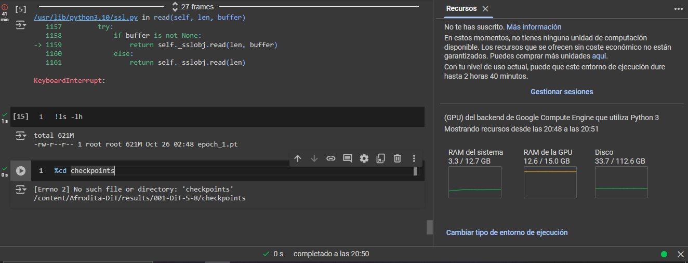

# 🐉Afrodita-DiT is a text-driven DiT implementation, I hope you like it :b

## Train File test with MNIST is ``` TrainDiT2TestMnist.py ```

Terminal:  
``` 
python TrainDiT2TestMnist.py  --batch-size 4 --epochs 10
```
If you have a 24GB graphics card you can train with it with these settings:

``` 
python TrainDiT2TestMnist.py  --batch-size 48 --epochs 10
```

## Train File with Flickr30k is ``` TrainDiTFlickr30k.py ```

Terminal:  
``` 
python TrainDiTFlickr30k.py  --batch-size 10 --epochs 10
```


## First training test with MNIST

|   Image generated at epoch 0 and step 2900📸   |   Real image at epoch 0 and step 2900📸   |   Image generated at epoch 1 and step 1100📸   |   Real image at epoch 1 and step 1100📸   | 
| :------------------------: | :--------------------------: | :-------------------------: | :-------------------------: |
|  |  |  |  |

## Training tests are being done in Colab with the model size "DiT-S/8" and the first checkpoint that was saved has the size of 621MB, then I will do a test with some dataset like MSCOCO or flickr30k




## I have based myself on the Meta repo: https://github.com/facebookresearch/DiT.git
